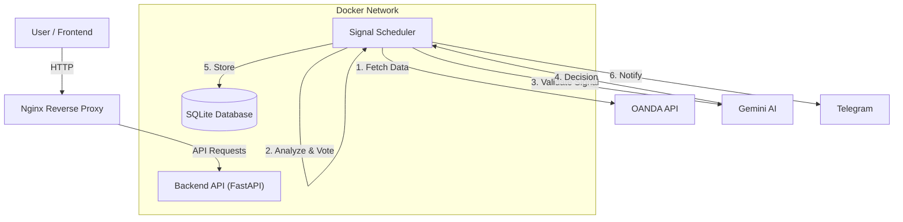

# 🚀 AlphaForge Trading System - Complete Interview Guide

**Institutional-Grade Algorithmic Trading System powered by Python, FastAPI, Docker, and Gemini AI**


---

## 📋 Table of Contents

1. [Project Overview](#-project-overview)
2. [Why I Built This](#-why-i-built-this)
3. [System Architecture](#-system-architecture)
4. [Technology Stack](#-technology-stack)
5. [Core Components Deep Dive](#-core-components-deep-dive)
6. [Signal Generation Pipeline](#-signal-generation-pipeline)
7. [Machine Learning Integration](#-machine-learning-integration)
8. [AI Validation with Gemini](#-ai-validation-with-gemini)
9. [Database Design](#-database-design)
10. [API Endpoints](#-api-endpoints)
11. [Frontend Dashboard](#-frontend-dashboard)
12. [Docker & Deployment](#-docker--deployment)
13. [Testing Strategy](#-testing-strategy)
14. [Challenges & Solutions](#-challenges--solutions)
15. [Future Improvements](#-future-improvements)
16. [Interview Q&A](#-interview-qa)

---

## 🎯 Project Overview

AlphaForge is a **fully automated trading signal generation system** designed for the OANDA brokerage ecosystem. It analyzes forex and commodity markets (GBP/USD, XAU/USD Gold, USD/JPY) to generate high-probability trading signals using:

- **Multi-timeframe Technical Analysis** (M5, M15, H1)
- **Gaussian Mixture Model (GMM) Market Regime Detection**
- **Kelly Criterion Position Sizing**
- **Large Language Model (LLM) Validation** via Google Gemini AI
- **Real-time Telegram Notifications**

### Key Metrics
| Metric | Value |
|--------|-------|
| Instruments Traded | 3 (GBP/USD, XAU/USD, USD/JPY) |
| Timeframes Analyzed | 3 (M5, M15, H1) |
| Technical Indicators | 6 per timeframe |
| Signal Cycle | Every 5 minutes |
| AI Validation | Google Gemini Pro |
| Deployment | Docker on Oracle Cloud VM |

---

## 💡 Why I Built This

### Problem Statement
Retail traders often make emotional decisions and lack the discipline to follow a consistent strategy. They also cannot monitor markets 24/7.

### Solution
AlphaForge automates the entire trading analysis process:
1. **Removes emotion** - Signals are purely algorithmic
2. **24/7 monitoring** - Runs continuously on cloud VM
3. **Multi-layer validation** - Signals pass through technical filters AND AI review
4. **Instant notifications** - Telegram alerts with full signal details

### Personal Learning Goals
- Build a production-grade Python application
- Learn FastAPI for REST API development
- Implement machine learning (GMM) in a real-world context
- Integrate LLM APIs (Gemini) for intelligent decision-making
- Master Docker containerization and deployment

---

## 🏗️ System Architecture

```
┌─────────────────────────────────────────────────────────────────────────┐
│                           AlphaForge System                              │
├─────────────────────────────────────────────────────────────────────────┤
│                                                                          │
│  ┌─────────────┐    ┌─────────────┐    ┌─────────────┐                  │
│  │   OANDA     │    │   Gemini    │    │  Telegram   │                  │
│  │    API      │    │     AI      │    │    Bot      │                  │
│  └──────┬──────┘    └──────┬──────┘    └──────▲──────┘                  │
│         │                  │                  │                          │
│         ▼                  ▼                  │                          │
│  ┌─────────────────────────────────────────────────────────────────────┐│
│  │                    Docker Container Network                          ││
│  │  ┌─────────────┐  ┌─────────────┐  ┌─────────────┐                  ││
│  │  │  Backend    │  │  Scheduler  │  │  Telegram   │                  ││
│  │  │  (FastAPI)  │◄─┤  Service    │  │   Service   │                  ││
│  │  │  Port 8000  │  │  (5 min)    │  │             │                  ││
│  │  └──────┬──────┘  └──────┬──────┘  └──────▲──────┘                  ││
│  │         │                │                │                          ││
│  │         ▼                ▼                │                          ││
│  │  ┌─────────────────────────────────────────────────────────────────┐││
│  │  │                     SQLite Database                              │││
│  │  │  - Trading Signals    - Journal Entries    - Statistics          │││
│  │  └─────────────────────────────────────────────────────────────────┘││
│  └─────────────────────────────────────────────────────────────────────┘│
│                                                                          │
│  ┌─────────────────────────────────────────────────────────────────────┐│
│  │                     React Frontend (Vercel)                          ││
│  │  - Dashboard    - Signal History    - Journal    - TradingView      ││
│  └─────────────────────────────────────────────────────────────────────┘│
└─────────────────────────────────────────────────────────────────────────┘
```

### Mermaid Diagram


---

## 🛠️ Technology Stack

### Backend
| Technology | Purpose | Why Chosen |
|------------|---------|------------|
| **Python 3.11** | Core language | Rich data science ecosystem |
| **FastAPI** | REST API framework | Async support, automatic OpenAPI docs |
| **SQLAlchemy** | ORM | Pythonic database operations |
| **Pandas** | Data manipulation | Industry standard for financial data |
| **NumPy** | Numerical computing | Fast array operations |
| **scikit-learn** | Machine learning | GMM for regime detection |
| **oandapyV20** | OANDA API client | Official broker integration |
| **python-dotenv** | Config management | Secure credential handling |

### Frontend
| Technology | Purpose | Why Chosen |
|------------|---------|------------|
| **React 18** | UI framework | Component-based architecture |
| **TailwindCSS** | Styling | Utility-first, rapid development |
| **Recharts** | Charts/graphs | React-native charting |
| **TradingView Widget** | Price charts | Professional trading charts |
| **Axios** | HTTP client | Promise-based API calls |

### Infrastructure
| Technology | Purpose | Why Chosen |
|------------|---------|------------|
| **Docker** | Containerization | Consistent environments |
| **Docker Compose** | Multi-container orchestration | Manage 3 services |
| **Oracle Cloud VM** | Hosting | Free tier, always-on |
| **Vercel** | Frontend hosting | Free, CDN, automatic deploys |
| **SQLite** | Database | Lightweight, no separate server |

### External APIs
| API | Purpose |
|-----|---------|
| **OANDA v3** | Real-time forex/commodity data |
| **Google Gemini Pro** | AI signal validation |
| **Telegram Bot API** | Push notifications |

---

## 🔍 Core Components Deep Dive

### 1. Multi-Timeframe Engine (`multi_timeframe_engine.py`)

**Purpose:** Fetch and analyze price data across M5, M15, and H1 timeframes with weighted confluence.

```python
# Timeframe configuration with weights
self.timeframes = {
    'M5': {'granularity': 'M5', 'count': 500, 'weight': 0.20, 'name': '5-minute'},
    'M15': {'granularity': 'M15', 'count': 300, 'weight': 0.30, 'name': '15-minute'},
    'H1': {'granularity': 'H1', 'count': 200, 'weight': 0.50, 'name': '1-hour'}
}
```

**Key Features:**
- **Async data fetching** using `asyncio` for parallel API calls
- **6 technical indicators** calculated per timeframe:
  1. EMA Ribbon (5, 8, 13)
  2. Fast RSI (7-period)
  3. Fast MACD (6-13-4)
  4. Bollinger Bands (14, 2.0)
  5. Stochastic (5-3)
  6. Volume Confirmation
- **Weighted voting system** where indicators cast votes for BUY/SELL

**Voting Algorithm:**
```python
# Signal decision based on weighted votes
if avg_buy_votes >= self.min_votes_required and avg_buy_votes > avg_sell_votes:
    signal_type = 'BUY'
    strength = (avg_buy_votes / 6.0) * 100
elif avg_sell_votes >= self.min_votes_required and avg_sell_votes > avg_buy_votes:
    signal_type = 'SELL'
    strength = (avg_sell_votes / 6.0) * 100
else:
    signal_type = 'NO_ACTION'
```

---

### 2. Market Regime Detector (`regime_detector.py`)

**Purpose:** Classify current market conditions using Gaussian Mixture Model (GMM) to avoid unfavorable trading environments.

**Market Regimes Detected:**
| Regime | Description | Trading Action |
|--------|-------------|----------------|
| `TRENDING_UP_LOW_VOL` | Strong uptrend, low volatility | ✅ Trade (1.2x size) |
| `TRENDING_DOWN_LOW_VOL` | Strong downtrend, low volatility | ✅ Trade (1.2x size) |
| `TRENDING_UP_HIGH_VOL` | Uptrend with high volatility | ✅ Trade (0.9x size) |
| `TRENDING_DOWN_HIGH_VOL` | Downtrend with high volatility | ✅ Trade (0.9x size) |
| `RANGING_LOW_VOL` | Sideways, low volatility | ✅ Trade (0.8x size) |
| `RANGING_HIGH_VOL` | Choppy, high volatility | ❌ Skip |
| `TRANSITIONAL` | Regime changing | ⚠️ Caution (0.6x size) |

**GMM Implementation:**
```python
from sklearn.mixture import GaussianMixture

self.gmm = GaussianMixture(
    n_components=4,           # 4 clusters
    covariance_type='full',   # Full covariance matrix
    random_state=42,
    max_iter=100
)
```

**Features Used for Classification:**
- Returns and return volatility
- ADX (trend strength)
- ATR % (volatility)
- Volume ratio
- RSI normalized

---

### 3. Kelly Criterion Position Sizing (`kelly_criterion.py`)

**Purpose:** Calculate optimal position size based on historical win rate and risk/reward.

**Kelly Formula:**
```
f* = (W × R - L) / R

Where:
- f* = Optimal fraction of capital to risk
- W = Win probability
- L = Loss probability (1 - W)
- R = Average win/loss ratio
```

**Implementation:**
```python
class KellyCriterion:
    def __init__(self, lookback_trades=50, kelly_fraction=0.25):
        self.lookback_trades = lookback_trades
        self.kelly_fraction = kelly_fraction  # Conservative (quarter Kelly)
        self.trade_history = []
    
    def calculate_optimal_fraction(self):
        wins = [t for t in self.trade_history if t['pnl'] > 0]
        losses = [t for t in self.trade_history if t['pnl'] <= 0]
        
        win_rate = len(wins) / len(self.trade_history)
        avg_win = sum(t['pnl'] for t in wins) / len(wins) if wins else 0
        avg_loss = abs(sum(t['pnl'] for t in losses) / len(losses)) if losses else 1
        
        kelly = (win_rate * avg_win - (1 - win_rate) * avg_loss) / avg_win
        return max(0, min(kelly * self.kelly_fraction, 0.25))  # Cap at 25%
```

---

### 4. Enhanced Strategy Integration (`enhanced_strategy_integration.py`)

**Purpose:** Orchestrate all components into the final signal generation pipeline.

**Pipeline Flow:**
```
1. Fetch Multi-Timeframe Data (M5, M15, H1)
       ↓
2. Detect Market Regime (GMM)
       ↓
3. Check if Regime is Tradeable
       ↓
4. Generate Multi-Timeframe Signal (Voting)
       ↓
5. Apply Quality Filters (ADX, Volatility, Strength)
       ↓
6. Calculate Position Sizing (Kelly × Regime Multiplier)
       ↓
7. Validate with Gemini AI
       ↓
8. Send Telegram Notification
       ↓
9. Store in Database
```

---

## 📊 Signal Generation Pipeline

### Step-by-Step Process

#### Step 1: Data Ingestion
Every 5 minutes, the scheduler triggers signal generation:

```python
# Fetch 3 timeframes in parallel
mtf_data = await self.mtf_engine.fetch_multi_timeframe(instrument)
# Returns: {'M5': DataFrame, 'M15': DataFrame, 'H1': DataFrame}
```

#### Step 2: Regime Detection
```python
regime = self.regime_detector.detect_regime(df_m5, instrument)
# Returns: MarketRegime.TRENDING_UP_LOW_VOL (or other)

should_trade = self.regime_detector.should_trade(regime)
# Returns: True/False
```

#### Step 3: Indicator Voting
Each indicator casts a vote:

| Indicator | BUY Condition | SELL Condition |
|-----------|---------------|----------------|
| EMA Ribbon | EMA5 > EMA8 > EMA13 | EMA5 < EMA8 < EMA13 |
| RSI (7) | < 30 (oversold) | > 70 (overbought) |
| MACD | MACD > Signal, Histogram > 0 | MACD < Signal, Histogram < 0 |
| Bollinger | Near lower band | Near upper band |
| Stochastic | < 20 with crossover | > 80 with crossover |
| Volume | High volume confirms | High volume confirms |

#### Step 4: Quality Filters
Signals must pass:
- **Volatility:** 0.02% ≤ ATR% ≤ 1.0%
- **Trend Strength:** ADX ≥ 25
- **Signal Strength:** ≥ 15% (votes/indicators)
- **Timeframe Agreement:** ≥ 50% (2/3 timeframes agree)

#### Step 5: Entry/Exit Calculation
```python
# ATR-based stop loss and take profit
if signal == 'BUY':
    stop_loss = current_price - (atr * 1.5)
    take_profit = current_price + (atr * 3.0)  # 1:2 R:R
elif signal == 'SELL':
    stop_loss = current_price + (atr * 1.5)
    take_profit = current_price - (atr * 3.0)  # 1:2 R:R
```

---

## 🤖 Machine Learning Integration

### Gaussian Mixture Model (GMM)

**What is GMM?**
GMM is an unsupervised clustering algorithm that assumes data is generated from a mixture of several Gaussian distributions.

**Why GMM for Regime Detection?**
- **Soft clustering:** Provides probability of belonging to each regime
- **Handles overlapping regimes:** Markets can transition gradually
- **No predefined labels:** Learns from data patterns

**Feature Engineering:**
```python
features = pd.DataFrame()
features['returns'] = df['close'].pct_change()
features['returns_std'] = features['returns'].rolling(20).std()
features['returns_skew'] = features['returns'].rolling(20).skew()
features['returns_kurt'] = features['returns'].rolling(20).kurt()
features['trend_strength'] = df['adx'] / 50  # Normalized
features['volatility'] = df['atr'] / df['close']
features['volume_ratio'] = df['volume'] / df['volume'].rolling(20).mean()
```

**Model Training:**
```python
from sklearn.preprocessing import StandardScaler

# Standardize features
scaled_features = self.scaler.fit_transform(features)

# Fit GMM with 4 clusters
self.gmm.fit(scaled_features)
self.is_fitted = True
```

---

## 🧠 AI Validation with Gemini

### Why AI Validation?

Technical analysis alone can produce false signals. Gemini AI acts as a "second opinion" from a hedge fund analyst perspective.

### Implementation
```python
# Prompt sent to Gemini
prompt = f"""
You are an institutional forex analyst. Analyze this trade setup:

**{signal['symbol']}** - **{signal['direction']}**
- Entry: {signal['entry']:.5f}
- Stop Loss: {signal['stop_loss']:.5f}
- Take Profit: {signal['take_profit']:.5f}
- Confidence: {signal['confidence_score']:.1f}%
- Market Regime: {signal['market_regime']}

Should this trade be taken? Reply CONFIRM or REJECT with reasoning.
"""

response = gemini.generate_content(prompt)
decision = parse_gemini_response(response.text)
```

### What Gemini Checks
1. **Pattern contradictions** (e.g., buying into resistance)
2. **Macro alignment** (e.g., major news events)
3. **Risk/reward logic** (is SL too tight?)
4. **Regime appropriateness** (strategy fits market type)

---

## 🗄️ Database Design

### Schema: Trading Signals
```sql
CREATE TABLE trading_signals (
    id INTEGER PRIMARY KEY AUTOINCREMENT,
    timestamp DATETIME NOT NULL,
    symbol VARCHAR(20) NOT NULL,
    direction VARCHAR(10) NOT NULL,  -- 'BUY' or 'SELL'
    entry FLOAT NOT NULL,
    stop_loss FLOAT NOT NULL,
    tp1 FLOAT NOT NULL,
    tp2 FLOAT,
    tp3 FLOAT,
    rr_ratio VARCHAR(20),
    confidence_score FLOAT,
    status VARCHAR(20) DEFAULT 'PENDING',
    outcome VARCHAR(20),  -- WIN, LOSS, BREAKEVEN
    market_condition VARCHAR(50),
    signal_strength VARCHAR(20),
    reasoning TEXT,
    notes TEXT,
    created_at DATETIME DEFAULT CURRENT_TIMESTAMP
);
```

### Schema: Journal Entries
```sql
CREATE TABLE journal_entries (
    id INTEGER PRIMARY KEY AUTOINCREMENT,
    signal_id INTEGER,
    entry_time DATETIME,
    exit_time DATETIME,
    symbol VARCHAR(20),
    direction VARCHAR(10),
    entry_price FLOAT,
    exit_price FLOAT,
    pnl FLOAT,
    pips FLOAT,
    r_multiple FLOAT,
    notes TEXT,
    FOREIGN KEY (signal_id) REFERENCES trading_signals(id)
);
```

---

## 📡 API Endpoints

| Method | Endpoint | Description |
|--------|----------|-------------|
| `GET` | `/health` | System health check |
| `GET` | `/api/status` | All component statuses |
| `GET` | `/api/signals` | Get all signals |
| `GET` | `/api/signals/today` | Today's signals only |
| `POST` | `/api/signals/create` | Manual signal creation |
| `POST` | `/api/signals/enhanced/generate` | Trigger full analysis |
| `GET` | `/api/stats` | Trading statistics |

### Example Response
```json
{
    "status": "success",
    "signals_generated": 1,
    "results": [
        {
            "pair": "GBP_USD",
            "signal_id": 123,
            "direction": "BUY",
            "confidence": 75.5,
            "regime": "trending_up_low_volatility"
        }
    ]
}
```

---

## 🖥️ Frontend Dashboard

### Components
| Component | Function |
|-----------|----------|
| `Dashboard.jsx` | Main overview with stats |
| `SignalCard.jsx` | Individual signal display |
| `TradingViewWidget.jsx` | Interactive price charts |
| `JournalPage.jsx` | Trade journaling |

### Key Features
- Real-time updates via polling (30 seconds)
- TradingView integration for professional charts
- Responsive design with Tailwind CSS
- Signal filtering by status, symbol, date

---

## 🐳 Docker & Deployment

### Docker Compose Configuration
```yaml
version: '3.8'

services:
  backend:
    image: alphaforge-backend:latest
    build:
      context: ./backend
    network_mode: host
    volumes:
      - ./trading_signals.db:/app/backend/trading_signals.db
    env_file:
      - .env
    restart: always
    command: python app.py

  scheduler:
    image: alphaforge-backend:latest
    depends_on:
      - backend
    restart: always
    command: python signal_scheduler.py

  telegram_bot:
    image: alphaforge-backend:latest
    depends_on:
      - backend
    restart: always
    command: python telegram_bot.py
```

### Deployment Steps
1. SSH into Oracle Cloud VM
2. Clone repository
3. Set up environment variables
4. Run `docker-compose up -d --build`
5. Verify with `docker ps`

---

## 🔧 Challenges & Solutions

### Challenge 1: Duplicate Signal Prevention
**Problem:** Multiple signals generated for same pair within cooldown.

**Solution:** 25-minute cooldown check:
```python
cooldown_minutes = 25
cutoff_time = datetime.utcnow() - timedelta(minutes=cooldown_minutes)

recent_signal = db.query(TradingSignal).filter(
    TradingSignal.symbol == symbol,
    TradingSignal.timestamp >= cutoff_time
).first()

if recent_signal:
    continue  # Skip this pair
```

### Challenge 2: Rate Limiting OANDA API
**Solution:** `asyncio.gather()` for parallel fetching:
```python
async def fetch_multi_timeframe(self, instrument):
    tasks = [self.fetch_candles_async(instrument, tf) for tf in timeframes]
    results = await asyncio.gather(*tasks)
```

### Challenge 3: False Signals in Choppy Markets
**Solution:** GMM regime detection filters `RANGING_HIGH_VOL`:
```python
unfavorable_regimes = {MarketRegime.RANGING_HIGH_VOL, MarketRegime.UNKNOWN}
return regime not in unfavorable_regimes
```

---

## 🚀 Future Improvements

1. **PostgreSQL Migration** - For production scalability
2. **Webhook-based Execution** - Auto-execute trades via OANDA
3. **Backtesting Framework** - Historical performance testing
4. **More Instruments** - EUR/USD, AUD/USD, etc.
5. **Mobile App** - React Native notification app
6. **ML Model Improvement** - LSTM for price prediction

---

## ❓ Interview Q&A

### Architecture Questions

**Q: Why FastAPI over Flask/Django?**
- Async support for I/O-bound operations
- Automatic OpenAPI documentation
- Built-in Pydantic validation
- Faster for concurrent API calls

**Q: Why SQLite instead of PostgreSQL?**
- Single-user system (no concurrent writes)
- Zero configuration
- Portable database file
- Sufficient for signal volume

---

### Machine Learning Questions

**Q: Explain the GMM you used.**
- Unsupervised clustering with probabilistic assignment
- 4 components representing market regimes
- Features: volatility, ADX, volume, returns
- Provides confidence score per classification

**Q: Why not supervised learning?**
- No labeled historical data for regimes
- Regimes are continuous, not discrete
- GMM handles overlapping clusters
- Adapts to changing conditions

---

### Trade Execution Questions

**Q: How are SL/TP calculated?**
- ATR-based dynamic levels
- SL = Entry ± (ATR × 1.5)
- TP = Entry ± (ATR × 3.0)
- Maintains 1:2 Risk:Reward

**Q: What is Kelly Criterion?**
- Formula for optimal bet sizing
- Uses historical win rate and win/loss ratio
- I use quarter-Kelly (25%) for conservatism

---

## 🛡️ Risk Disclaimer

*Trading Forex and CFDs carries high risk and may not be suitable for all investors. Past performance is not indicative of future results.*

---

© 2025 AlphaForge. All Rights Reserved.
