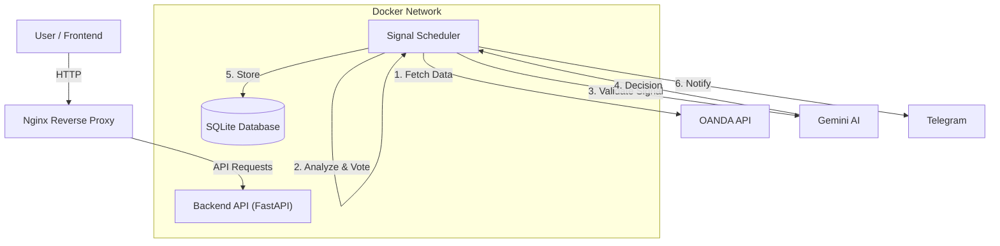

# 🚀 AlphaForge Trading System

**Institutional-Grade Algorithmic Trading System powered by Python, Docker, and Gemini AI.**

AlphaForge is a sophisticated automated trading platform designed using the OANDA brokerage Api. It leverages multi-timeframe technical analysis, adaptive market regime detection, and Large Language Model (LLM) validation to generate high-probability trading signals.


---

## 📖 How It Works: The AlphaForge Pipeline

AlphaForge operates on a 5-minute cycle, continuously scanning the market for high-probability opportunities. Here is the step-by-step process of how a signal is generated, validated, and delivered.

### 1. 📥 Data Ingestion (Multi-Timeframe)
Every cycle, the system fetches live candlestick data from OANDA for three distinct timeframes to ensure a complete market view:
*   **M5 (5-Minute):** For tactical entry timing.
*   **M15 (15-Minute):** For immediate trend confirmation.
*   **H1 (1-Hour):** For dominant trend direction and major support/resistance.

### 2. 🧠 Market Regime Detection
Before looking for signals, the system identifies the current "weather" of the market. It classifies the market into one of several regimes:
*   **Trending Bullish/Bearish:** Strong directional movement (Ideal for trend-following).
*   **Ranging/Sideways:** Price moving between bounds (Ideal for mean reversion).
*   **Volatile:** High unpredictability (System tightens risk or stands aside).

*Technicals used:* ADX (Trend Strength), ATR (Volatility), and EMA alignment.

### 3. ⚡ Signal Generation (The Voting Engine)
The system uses a **weighted voting mechanism** rather than simple crossovers. Multiple indicators cast "votes" on whether to Buy, Sell, or Hold.
*   **Trend Indicators:** EMA Ribbon (8, 21, 55), ALMA (Arnaud Legoux Moving Average).
*   **Momentum:** RSI (Relative Strength Index), Stochastic Oscillator.
*   **Volatility:** Bollinger Bands (for breakouts or mean reversion).
*   **Volume:** Volume Flow Indicator (VFI) to confirm price movement validity.

A signal is only proposed if the **Confidence Score exceeds 60%** and there is **confluence** across timeframes (e.g., M5 and H1 agree).

### 4. 🤖 Gemini AI Validation (The "Hedge Fund Analyst")
This is AlphaForge's unique edge. Raw signals are **not** immediately traded. They are packaged into a prompt and sent to Google's **Gemini Pro AI**.
*   **The Prompt:** Contains technical data, regime context, key levels, and the proposed trade.
*   **The AI's Job:** Gemini analyzes the setup like a human analyst. It checks for:
    *   Contradictory patterns (e.g., buying into major resistance).
    *   Macro sentiment alignment.
    *   Risk-to-reward logic.
*   **The Verdict:** Gemini returns a `CONFIRM` or `REJECT` decision along with a reasoning summary.

### 5. 🎯 Execution & Notification
If Gemini approves the trade:
1.  **Dynamic Risk Management:** Stop Loss (SL) and Take Profit (TP) are calculated based on market volatility (ATR).
2.  **Database Logging:** The full signal details are saved to the SQLite database.
3.  **Telegram Alert:** A formatted notification is instantly sent to your Telegram channel with entry, SL, TP, and the AI's reasoning.

---

## 🏗️ System Architecture



---

## 🚀 Getting Started

### Prerequisites
*   Docker & Docker Compose
*   OANDA Trading Account (Demo or Live)
*   Google Cloud API Key (for Gemini AI)

### Installation

1.  **Clone the Repository**
    ```bash
    git clone https://github.com/sadaru2002/AlphaForge.git
    cd AlphaForge
    ```

2.  **Configure Environment**
    Create a `.env` file in the root directory:
    ```env
    # OANDA Configuration
    OANDA_API_KEY=your_oanda_key
    OANDA_ACCOUNT_ID=your_account_id
    OANDA_BASE_URL=https://api-fxpractice.oanda.com/v3
    
    # AI Configuration
    GEMINI_API_KEY=your_gemini_key
    
    # Telegram
    TELEGRAM_BOT_TOKEN=your_bot_token
    TELEGRAM_CHAT_ID=your_chat_id
    ```

3.  **Deploy with Docker**
    ```bash
    # Build and start services
    docker-compose up -d --build
    ```

4.  **Access the System**
    *   **Backend API:** `http://localhost` (Port 80 via Nginx)
    *   **Health Check:** `http://localhost/health`

---

## 📡 API Endpoints

| Method | Endpoint | Description |
|--------|----------|-------------|
| `GET` | `/health` | System health status |
| `GET` | `/api/status` | Detailed component status |
| `GET` | `/api/signals` | Retrieve generated signals |
| `POST` | `/api/signals/enhanced/generate` | Trigger manual analysis cycle |

---

## 🛡️ Risk Disclaimer

*Trading Forex and CFDs carries a high level of risk and may not be suitable for all investors. The high degree of leverage can work against you as well as for you. Before deciding to trade, you should carefully consider your investment objectives, level of experience, and risk appetite. The possibility exists that you could sustain a loss of some or all of your initial investment.*

---

© 2025 AlphaForge. All Rights Reserved.
